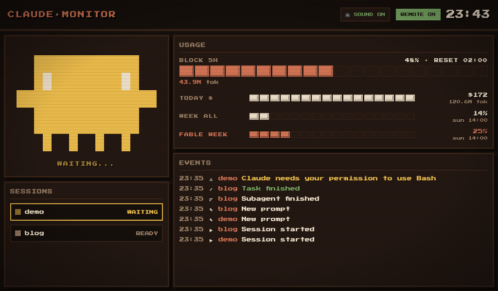
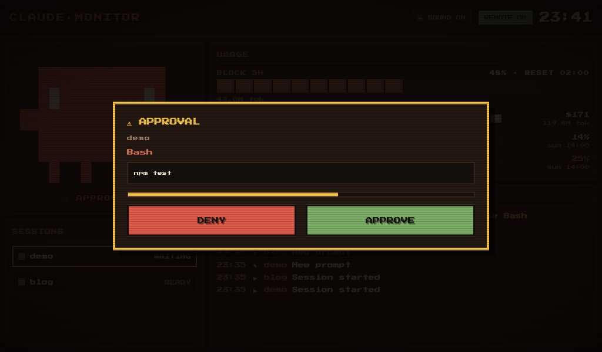
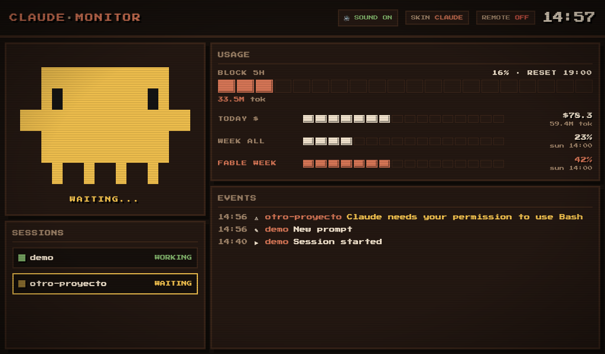
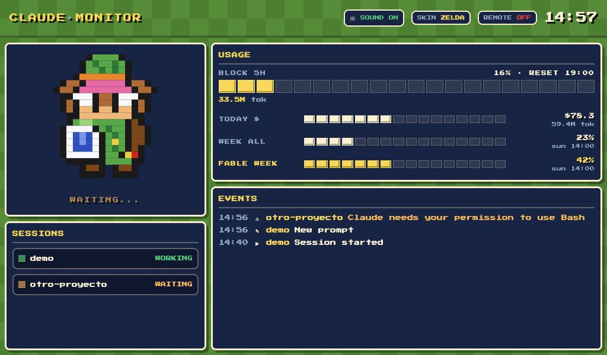
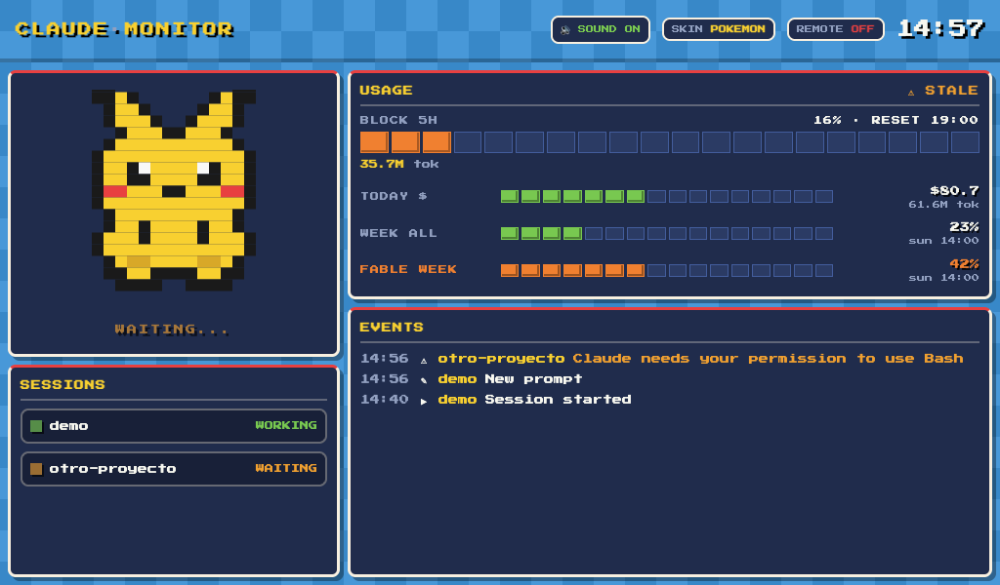
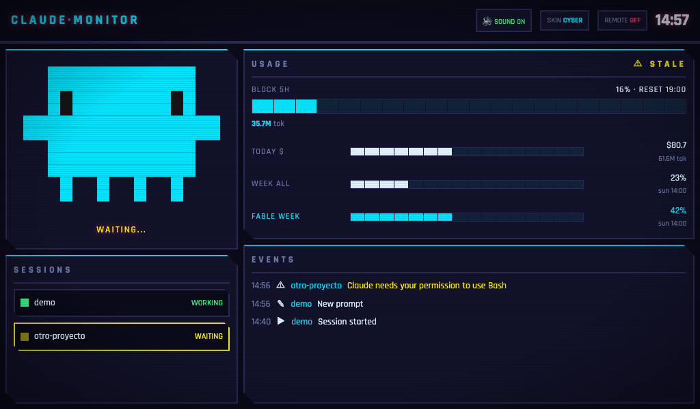
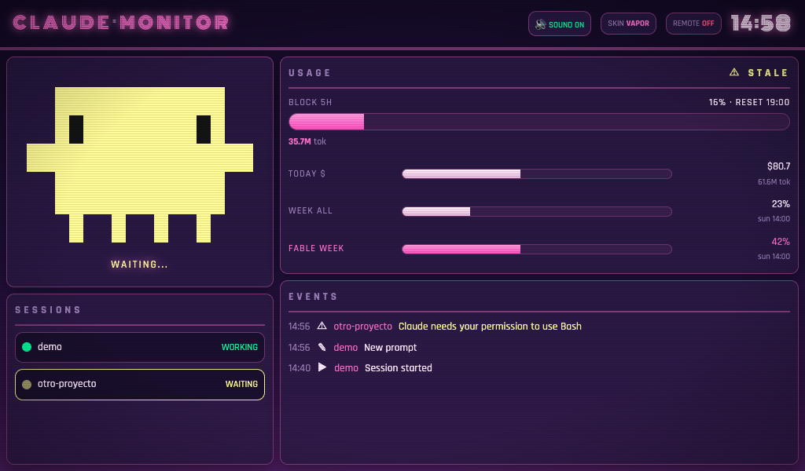
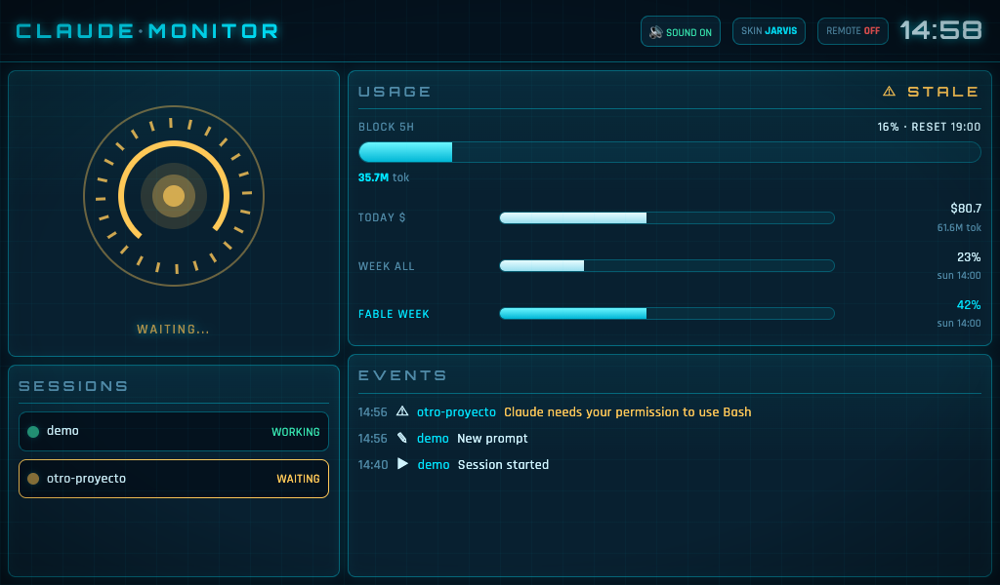

# claude-code-monitor

A pixel-art kiosk dashboard that monitors your **Claude Code** sessions in real
time — designed to be cast to a **Google Nest Hub** (2nd gen) so you can watch
your agents work, hear 8-bit chiptune alerts, and **approve or deny permission
requests by tapping the Hub's screen**.



## Features

- **Live session board** — every Claude Code session on your machine, its
  project, status (working / waiting / ready) and latest event, streamed over SSE.
- **Remote touch approval** — flip the REMOTE toggle and Bash/Write/Edit
  permission requests appear as cards on the Hub with APPROVE / DENY buttons
  and a 28s countdown. Fail-open by design: if you don't answer (or the server
  is down), Claude Code falls back to its normal terminal prompt. Never blocks.
- **Plan usage bars** — the same percentages `/usage` shows (5h block, weekly),
  read from Claude Code's own OAuth token, plus cost estimates via
  [ccusage](https://github.com/ryoppippi/ccusage).
- **Skins** — tap the SKIN chip in the header to cycle six full identities
  (see the [gallery](#skins-gallery)): **Claude**, the retro default — short-tap
  the mascot to swap its eyes between classic, smug `¬ ¬`, chevron `> <` and
  thug-life pixel shades; **Zelda**, an SNES game screen — grass-checker field,
  dialog-box panels, Triforce gold and a pixel Link mascot; **Pokémon**, the
  four starters — water field, Pikachu accents, Bulbasaur/Charmander bar
  colors, and a short-tap on the mascot cycles Pikachu → Bulbasaur →
  Charmander → Squirtle; **Cyberpunk** — chamfered neon panels and an
  RGB-glitch mascot; **Vaporwave** — Monoton neon title over a purple
  gradient; and **Jarvis** — a holographic HUD with grid, thin glowing panels
  and an animated arc-reactor mascot. Modern-skin fonts (Orbitron, Rajdhani,
  Monoton) are bundled locally under the OFL license — still zero CDNs.
  The skin and mascot choice live on the server: they persist across restarts,
  apply to every connected browser at once, and can be forced via
  `curl -X POST localhost:8787/skin -H 'Content-Type: application/json' -d '{"skin":"jarvis"}'`
  (also accepts `{"variant":"squirt"}`).
- **Fits any screen** — the canvas is a fixed 1024×600 (the Hub's exact
  resolution) and auto-scales to fill any other browser window, centered.
- **8-bit chiptunes** — WebAudio-generated jingles for session start, task
  done, waiting for input, approvals and errors. No audio files. Press and
  hold the logo for ~1s to play all 11 jingles in sequence (handy sound check).
- **Zero dependencies** — native Node server, vanilla JS frontend, local font.
  Nothing leaves your LAN.



## Requirements

| | macOS | Linux |
|---|---|---|
| [Node.js](https://nodejs.org) ≥ 18 | ✓ | ✓ |
| [Claude Code](https://claude.com/claude-code) | ✓ | ✓ |
| [catt](https://github.com/skorokithakis/catt) (only for casting) | `pipx install catt` | `pipx install catt` |
| Autostart | launchd | systemd (user units) |

Any browser works if you don't have a Nest Hub (the dashboard auto-scales to
the window) — casting is optional.

## Install

```sh
git clone https://github.com/slackwero/claude-code-monitor.git
cd claude-code-monitor
npm run setup
```

The wizard checks prerequisites, scans your network for cast devices, writes
`config.json`, installs the Claude Code hooks (additive — your existing hooks
are preserved, with a timestamped backup), links the `claude-monitor` CLI into
`~/.local/bin`, and optionally sets up autostart and casts right away.

Hooks apply to **new** Claude Code sessions; restart any open ones.
On macOS, the first run will ask to allow incoming connections for `node` —
accept it (the Hub needs to reach your machine over the LAN).

**No cast device?** Skip the device step in the wizard and just open
`http://localhost:8787` — or `http://<your-machine's-LAN-IP>:8787` from a
phone or tablet on the same network. The full dashboard, including
tap-to-approve, works in any browser; casting is entirely optional.

## CLI

```
claude-monitor start      install autostart, start everything, cast
claude-monitor stop       stop services, remove autostart, stop the cast
claude-monitor restart    relaunch the services
claude-monitor status     server + services + device state
claude-monitor cast       force a re-cast now
claude-monitor logs       follow logs live
claude-monitor hooks      (re)install the Claude Code hooks
claude-monitor hooks-off  remove the hooks
```

## How it works

```
Claude Code ──hooks──▶ forward-event.sh ──POST /hook──▶ ┌────────────────┐
    │                                                    │  Node server   │──SSE──▶ browser / Nest Hub
    └─PreToolUse──▶ approval-gate.sh ──long-poll──▶      │  (in-memory)   │◀─tap── APPROVE / DENY
                                                         └────────────────┘
```

Claude Code hooks (registered in `~/.claude/settings.json`) forward their JSON
to the local server, which keeps all state in memory and pushes deltas over
SSE. The approval gate long-polls `POST /approval/request`; a tap on the Hub
resolves it with a `permissionDecision`. Timeouts are chained (server 28s <
curl 32s < hook 40s) so the terminal prompt always wins over a dead server.

## Privacy & data

- Everything runs on `localhost` / your LAN. No telemetry, no external services.
- The plan-usage bars read Claude Code's OAuth token (macOS Keychain / Linux
  `~/.claude/.credentials.json`) to call `api.anthropic.com/api/oauth/usage` —
  the same endpoint `/usage` uses. The token lives only in server memory and is
  never logged or persisted.
- Cost estimates run via `npx ccusage` against your local Claude logs.

## Troubleshooting

- **Hub shows the dashboard but no sound** — cast receivers block autoplay:
  tap the "TAP FOR SOUND" chip once.
- **Hooks don't fire** — they only load in sessions started after install.
- **macOS: services die under launchd with EPERM on `~/Documents`** — macOS
  TCC restricts launchd access to Documents; clone the repo somewhere like
  `~/claude-code-monitor` instead, or grant access in System Settings.
- **Linux: services stop at logout** — run `loginctl enable-linger $USER`.
- **Cast drops after ~10 min** — that's the Hub returning to ambient mode; the
  keepalive service re-casts automatically within a minute.
- **No % bars, only $ estimates** — OAuth token not readable (no Keychain
  entry / credentials file); the dashboard falls back to ccusage estimates.

## Uninstall

```sh
claude-monitor stop        # services + autostart + cast
npm run uninstall-hooks    # removes only our hook entries
rm ~/.local/bin/claude-monitor
```

## Skins gallery

Tap the SKIN chip to cycle them; tap the mascot for its variants
(eye styles on Claude, starters on Pokémon).

| | |
|:---:|:---:|
|  |  |
| **Claude** — retro default, 4 eye styles | **Zelda** — SNES Hyrule, pixel Link |
|  |  |
| **Pokémon** — the four starters | **Cyberpunk** — neon, chamfered panels |
|  |  |
| **Vaporwave** — outrun neon | **Jarvis** — holographic HUD |

## License

[MIT](LICENSE) © 2026 Alexander Valera (slackwero)
